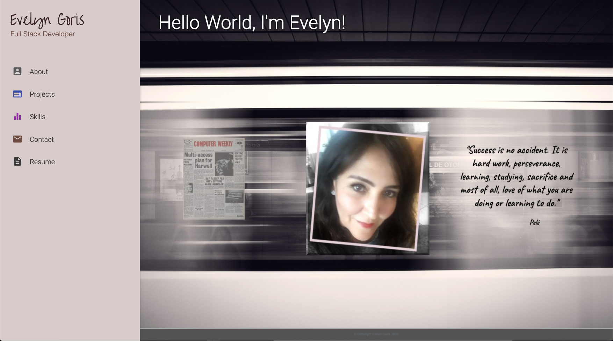

# Evelyn Goris Portfolio

[](https://opensource.org/licenses/MIT)
[](http://https://github.com/SIROG-E)

## Description

This application is my portfolio using React. My updated site contains:

- An About page where I introduce myself.

- A Project page with cards of my projects. For each project, I include the following:

  - Project title

  - Description

  - Link to the deployed version

  - Link to the GitHub repository

  - GIF or screenshot of the deployed application

- A Skill page where I showcase the skills I have gained during the Coding Program.

- A Contact page with links to my GitHub profile & LinkedIn page as well as my email address and phone number.

- A Resume page with a link to a PDF of my resume.

If you resize the screen you will view my **Mobile-first design**. Navbar hides when screen size is reduced and will display navbar when collapse button is clicked.

## Table of Contents

- [Description](#description)
- [Installation](#installation)
- [Preview](#preview)
- [Website](#website)
- [License](#license)
- [Contributing](#contributing)
- [Test](#tests)
- [Questions](#questions)

## Installation

```
No installation is needed to use this app.
```

`Simply click ` [here](https://evelyn-goris.herokuapp.com/) ` to view my portfolio.`

## Preview




### Website

[My React Portfolio Deployed Link](https://evelyn-goris.herokuapp.com/)

## License

This project is licensed by:\
[](https://opensource.org/licenses/MIT)

## Contributing

\
[SIROG-E](https://github.com/SIROG-E)

## Test


## Questions

If you have any questions, contact SIROG-E at goris.evelyn@gmail.com

## Repository

- [GitHub Repo Link](https://github.com/SIROG-E/Evelyn_Goris)

## GitHub


- Evelyn Goris
- [GitHub Profile](https://github.com/SIROG-E)
- goris.evelyn@gmail.com
